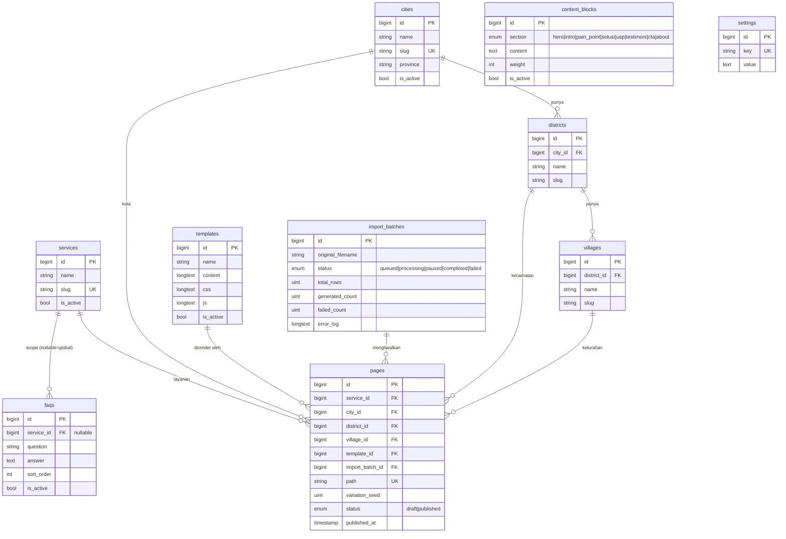
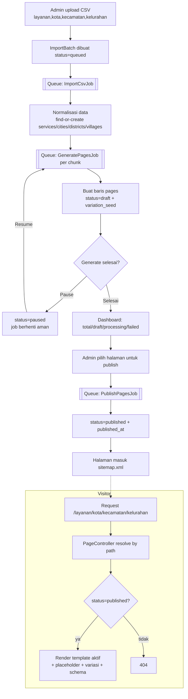

# BLUEPRINT — CEGU pSEO Engine (MVP)

> "Privat Nusantara Engine versi CEGU"
> Mesin Programmatic SEO (pSEO) berbasis Laravel 12 yang menghasilkan ribuan
> hingga jutaan halaman salespage dinamis dari satu template untuk mendatangkan
> lead via WhatsApp.

Dokumen ini adalah **Phase 0 (Blueprint)** sesuai RFP. Berisi: ERD, struktur
database, flowchart sistem, timeline, estimasi spesifikasi VPS, dan estimasi
biaya. Mohon di-review sebelum/selama tahap coding.

---

## 1. Ringkasan Arsitektur

| Komponen | Keputusan |
|---|---|
| Framework | Laravel 12 |
| Bahasa | PHP 8.4 |
| Database | MariaDB / MySQL |
| Web server | Nginx |
| Queue | Laravel Queue (driver: `database` untuk MVP, dapat di-upgrade ke Redis) |
| Process manager | Supervisor (menjaga `queue:work` tetap hidup) |
| Deployment | VPS Onidel |
| Versioning | Git |

**Prinsip desain inti:**

1. **1 template = jutaan halaman.** Halaman TIDAK menyimpan HTML hasil render.
   Yang disimpan hanya data terstruktur (FK lokasi/layanan + `variation_seed`).
   HTML dirender saat request berdasarkan template aktif. Akibatnya: **mengubah
   template → seluruh halaman ikut berubah otomatis** (syarat RFP terpenuhi).
2. **Konten unik tanpa AI eksternal.** Variasi konten salespage (sesuai PDF 2,
   "Formula Kombinasi") dipilih secara **deterministik** dari pool variasi
   menggunakan `variation_seed` per halaman. Stabil, gratis, dan reproducible.
3. **Generate dipisah dari Publish.** Dua antrian berbeda agar bisa
   pre-generate jutaan halaman (status `draft`) lalu mengontrol kecepatan
   publikasi (status `published`).
4. **Tabel `pages` ramping.** Hanya kolom kecil + index, supaya 1.000.000+ baris
   tetap ringan dan cepat di-query.

---

## 2. ERD (Entity Relationship Diagram)

---

## 3. Struktur Database (ringkas)

| Tabel | Fungsi | Catatan index |
|---|---|---|
| `services` | Daftar layanan (Les Privat Matematika, Guru Ngaji, …) | `unique(slug)` |
| `cities` | Kota | `unique(slug)` |
| `districts` | Kecamatan (milik kota) | `index(city_id)`, `unique(city_id, slug)` |
| `villages` | Kelurahan (milik kecamatan) | `index(district_id)`, `unique(district_id, slug)` |
| `pages` | Satu baris = satu URL halaman pSEO | `unique(path)`, `index(status)`, `unique(service_id,city_id,district_id,village_id)` |
| `templates` | Template salespage (HTML/CSS/JS/Blade) | `index(is_active)` |
| `content_blocks` | Pool variasi konten (spintax) per section | `index(section, is_active)` |
| `faqs` | FAQ (global atau per layanan) | `index(service_id, is_active)` |
| `import_batches` | Riwayat & status import CSV + generate | `index(status)` |
| `settings` | Key-value (nomor WA, brand, schema Organization) | `unique(key)` |
| `jobs`, `failed_jobs` | Bawaan Laravel Queue (driver database) | — |

**Kenapa `pages` ramping?** Untuk 1.000.000 baris, kita hanya menyimpan ~6
integer + 1 string `path` + status. Estimasi ±150–250 MB termasuk index — ringan.
Meta title, meta description, H1, summary, FAQ, testimoni, internal link → semua
**dirender on-the-fly** dari template + pool variasi, sehingga update template
langsung berlaku ke semua halaman.

---

## 4. Flowchart Sistem

---

## 5. Timeline Pengerjaan (estimasi)

> Asumsi 1 developer, fokus MVP. Estimasi kalender, bukan jam kerja murni.

| Minggu | Milestone | Output |
|---|---|---|
| **0** | Phase 0 — Blueprint | ERD, DB, flowchart, timeline, biaya (dokumen ini) — **review** |
| **1** | Fondasi | Scaffold Laravel 12, migrasi DB, model, seeder data contoh + variasi konten PDF 2 |
| **2** | Engine pSEO | Routing dinamis `/{layanan}/{kota}/{kecamatan}/{kelurahan}`, template engine + placeholder, render salespage + variasi deterministik |
| **3** | Import & Generate | Upload CSV, queue Import→Generate, status Draft, kontrol Start/Pause/Resume |
| **4** | Publish & SEO | Publish queue (draft→published), meta/canonical/H1/breadcrumb, schema FAQ/Breadcrumb/Organization, sitemap + sitemap index |
| **5** | Admin Panel | Editor template (syntax highlight + preview), kelola FAQ/variasi/WA, dashboard generate |
| **6** | Hardening & Handover | Uji beban 1 jt halaman, dokumentasi instalasi & penggunaan, perbaikan bug, serah terima |

**Estimasi durasi total: ±6 minggu** setelah Blueprint disetujui (+30 hari masa
bug-fixing sesuai RFP).

---

## 6. Estimasi Spesifikasi VPS

Sesuai rekomendasi RFP, dengan pembagian peran:

| Skenario | Spek | Catatan |
|---|---|---|
| **Generate besar (1 jt halaman)** | 8 vCPU, 16 GB RAM, NVMe 300–500 GB | Sesuai RFP. CPU/RAM dipakai saat batch generate & build sitemap. |
| **Operasional harian (serving)** | 2–4 vCPU, 4–8 GB RAM cukup | Karena halaman dirender ringan + bisa di-cache, beban serving rendah. |

**Rekomendasi praktis:** mulai dengan **8 vCPU / 16 GB / NVMe 320 GB**. Tambahan:

- **Swap 4–8 GB** sebagai pengaman saat batch besar.
- **MySQL tuning**: `innodb_buffer_pool_size` ±8 GB.
- **Supervisor**: 4–8 worker `queue:work` saat generate, diturunkan saat idle.
- **Full-page cache** (file/Redis) untuk halaman published → hemat CPU drastis.

---

## 7. Estimasi Biaya (kerangka)

> Angka final menyesuaikan kesepakatan. Tabel ini kerangka komponen biaya agar
> transparan. (Mata uang: indikatif, harap dikonfirmasi.)

| Komponen | Sifat | Catatan |
|---|---|---|
| Pengembangan MVP (≈6 minggu) | One-time | Sesuai timeline bagian 5 |
| Bug fixing 30 hari | Termasuk | Sesuai RFP |
| VPS Onidel (8 vCPU/16 GB) | Bulanan | Dibayar pemilik proyek |
| Domain | Tahunan | Dibayar pemilik proyek |
| Lisensi/plugin | **Rp 0** | RFP: tanpa plugin/lisensi bajakan; semua open-source |
| AI API | **Rp 0** | Summary pakai spintax internal, bukan API eksternal |

**Catatan:** estimasi nominal jasa pengembangan diisi pada proposal komersial
terpisah. Blueprint ini fokus pada lingkup teknis.

---

## 8. Ketentuan Serah Terima (checklist RFP)

- [ ] Source code lengkap + Git repository
- [ ] Database migration
- [ ] `.env.example`
- [ ] Dokumentasi instalasi (`docs/INSTALL.md`)
- [ ] Dokumentasi penggunaan admin (`docs/ADMIN_GUIDE.md`)
- [ ] Hak kepemilikan source code penuh ke pemilik proyek
- [ ] Bug fixing minimal 30 hari

**Ketentuan khusus dipatuhi:** tanpa plugin/lisensi bajakan, tanpa cloaking,
tanpa alamat palsu, struktur sederhana & mudah dikembangkan, kode rapi &
terdokumentasi.
